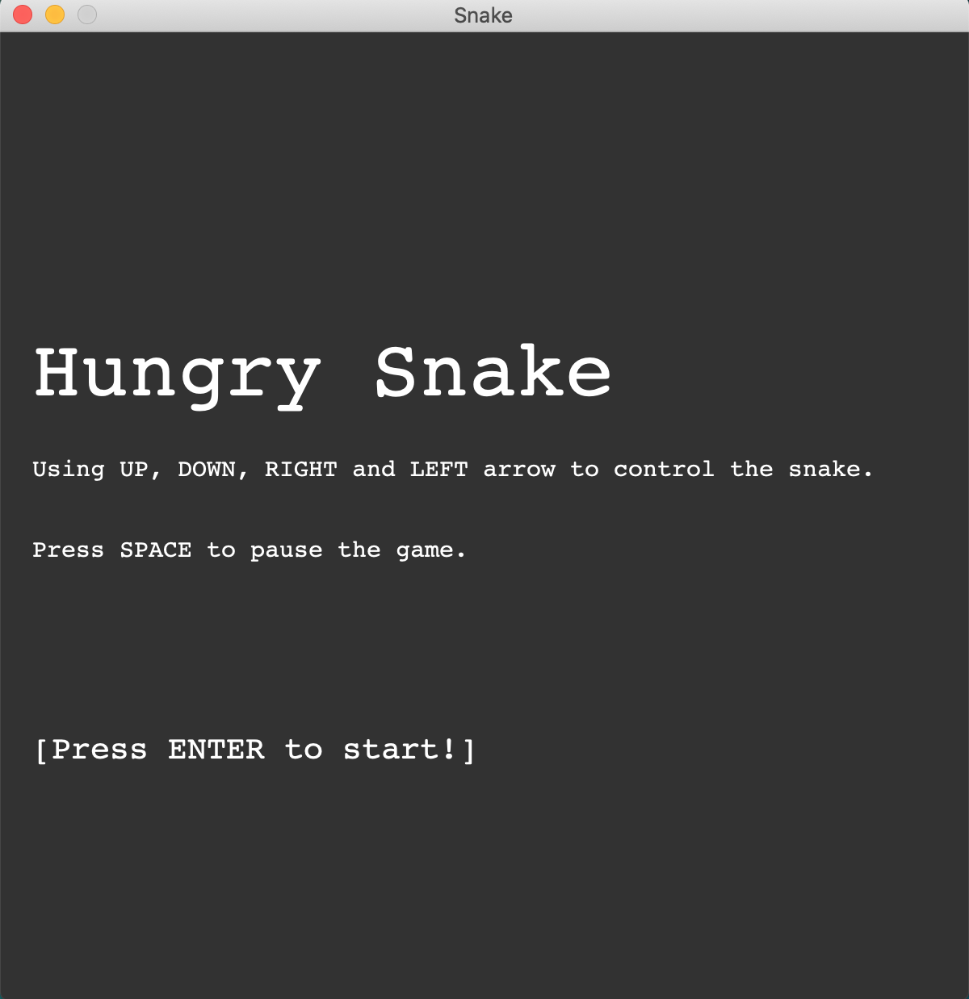
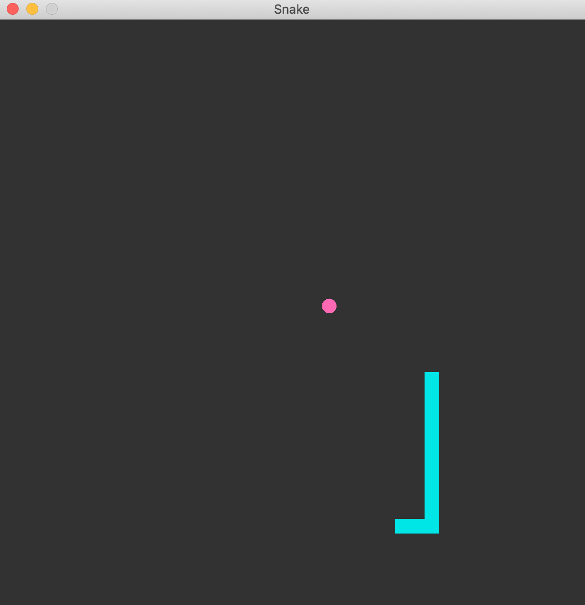
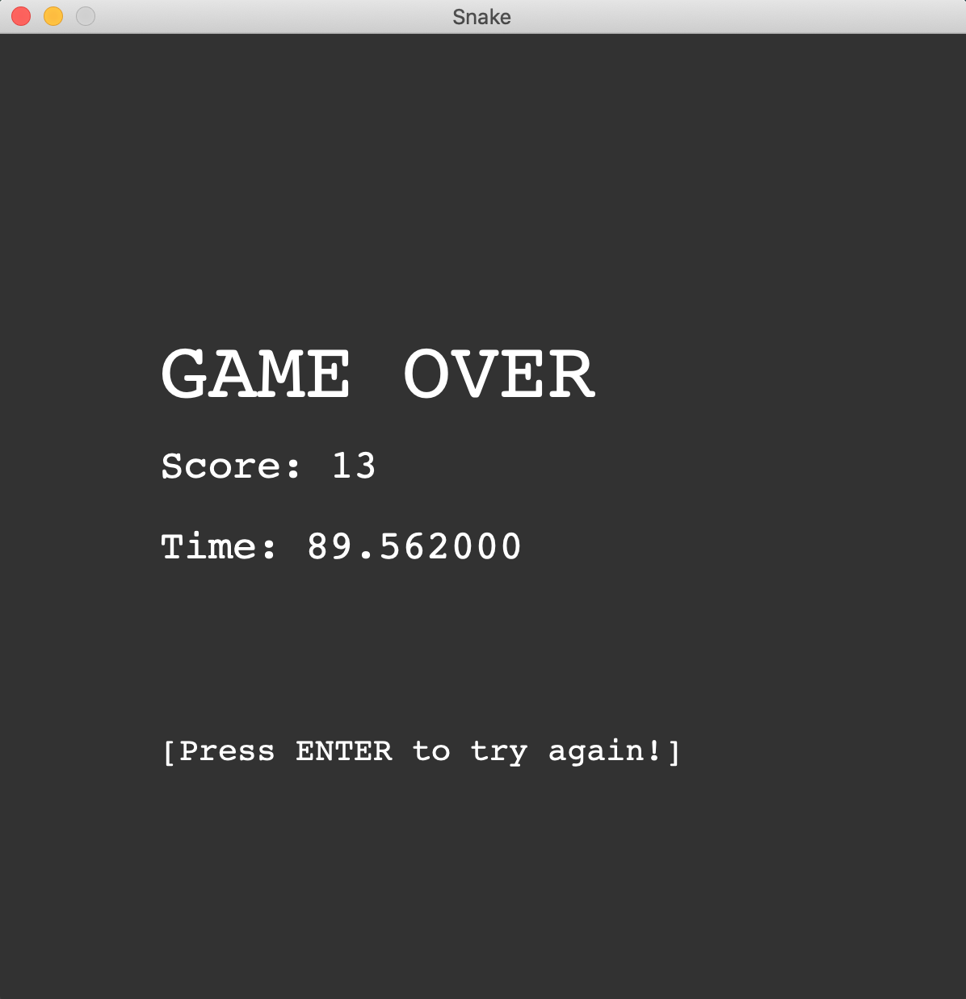

## Java Application - Hungry Snake Game

My implementation of a tiny game Hungry Snake. Developed based on java Swing.

## Usage
Download 

## UI
Using Swing `JFrame` and `JPanel` as Graphic UI to draw a `600 * 600` board.

## Animation
The main idea is to use `javax.swing.Timer` to fire `ActionEvent` at specified intervals. Then implement `JPanel` as a `ActionListener` to monitor the events sent by `Timer` so as to draw the animation frame by frame.

## Keyboard controls the snake
Bind `java.awt.event.KeyListener` to the panel using `java.swing.JPanel.addKeyListener()` method, so that panel can receive keyboard event.

## Snake and Apple
The snake is represented by an 2-dimensional array `int snake[size][2]`. Each pair of array is the x and y coordinates of a point.
